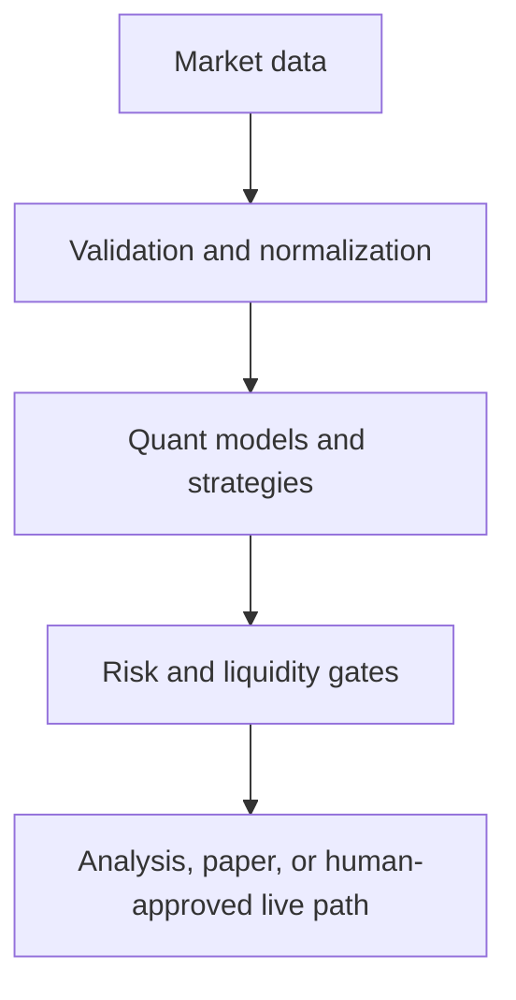

# Architecture

`etrade-options-quant-lab` is a research-first system. Quantitative functions are deterministic and broker-independent; the LLM/UI can explain results but cannot manufacture numbers or bypass risk controls.

## Components

- `data/`: provider contracts, the authorized E*TRADE adapter, canonical quotes, freshness and quality checks, plus an explicitly test-only fixture.
- `quant/`: pricing, Greeks, IV, volatility, probabilities, Bayesian updates, simulation, portfolio aggregation, metrics, and sizing.
- `strategies/`: research-only candidate construction. Strategies return data structures; they do not submit orders.
- `backtest/`: point-in-time event loop with configurable fill assumptions, spread, slippage, and fees.
- `brokers/paper/`: internal simulated broker with idempotent client order IDs, partial fills, outages, limit handling, and positions.
- `brokers/etrade/`: documented REST/OAuth adapter. Production order submission is behind `compliance/etrade_live_guard.py` and disabled by default.
- `apps/api/`: FastAPI surface, runtime paper-account state, and an explicitly requested math-validation payload. The math demo is never used as operational market data or performance.
- `apps/web/`: dashboard workstation for analysis and paper review.

## Modes

`ANALYSIS` never creates simulated or live orders. `PAPER` is the default and uses the internal broker. `LIVE` is a separately gated path and requires production configuration, fresh data, broker preview, risk checks, immutable ticket hash, and a short-lived single-use user approval token. No mode transition is automatic.

## Source of truth

The quantitative library is authoritative for values. API serialization preserves calculation inputs, outputs, model names, and assumptions where available. Broker adapters are not allowed to alter the model result. All timestamps are expected to be timezone-aware UTC values at the application boundary.

## Persistence direction

The MVP keeps the mathematical core stateless and supports SQLite locally. PostgreSQL is the deployment target. The persistence model should record raw data, normalized snapshots, candidates, tickets, orders, fills, positions, risk snapshots, experiments, model versions, and audit events. Secrets are configuration-only and never database data.

## Deferred by design

Historical option-chain replay, a durable SQLAlchemy/Alembic implementation, GARCH/Heston calibration, full multi-leg paper execution, and a production authentication layer are follow-on work. The UI shows explicit empty states when no provider is configured; it does not fabricate or disguise data as live.
